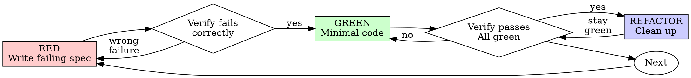

# Spec-Driven Development (SDD)

## Overview

Write the spec first. Watch it fail. Write minimal code to pass.

**Core principle:** If you didn't watch the spec fail, you don't know if it tests the right thing.

**Violating the letter of the rules is violating the spirit of the rules.**

## When to Use

**Always:**
- New features
- Bug fixes
- Refactoring
- Behavior changes

**Exceptions (ask your human partner):**
- Throwaway prototypes
- Generated code
- Configuration files

Thinking "skip SDD just this once"? Stop. That's rationalization.

## The Iron Law

```
NO PRODUCTION CODE WITHOUT A FAILING SPEC FIRST
```

Write code before the spec? Delete it. Start over.

**No exceptions:**
- Don't keep it as "reference"
- Don't "adapt" it while writing specs
- Don't look at it
- Delete means delete

Implement fresh from specs. Period.

## Red-Green-Refactor



### RED - Write Failing Spec

Write one minimal spec showing what should happen.

<Good>
```typescript
spec('retries failed operations 3 times', async () => {
  let attempts = 0;
  const operation = () => {
    attempts++;
    if (attempts < 3) throw new Error('fail');
    return 'success';
  };

  const result = await retryOperation(operation);

  expect(result).toBe('success');
  expect(attempts).toBe(3);
});
```
Clear name, specs real behavior, one thing
</Good>

<Bad>
```typescript
spec('retry works', async () => {
  const mock = jest.fn()
    .mockRejectedValueOnce(new Error())
    .mockRejectedValueOnce(new Error())
    .mockResolvedValueOnce('success');
  await retryOperation(mock);
  expect(mock).toHaveBeenCalledTimes(3);
});
```
Vague name, specs mock not code
</Bad>

**Requirements:**
- One behavior
- Clear name
- Real code (no mocks unless unavoidable)

### Verify RED - Watch It Fail

**MANDATORY. Never skip.**

```bash
npm test path/to/spec.spec.ts
```

Confirm:
- Spec fails (not errors)
- Failure message is expected
- Fails because feature missing (not typos)

**Spec passes?** You're testing existing behavior. Fix spec.

**Spec errors?** Fix error, re-run until it fails correctly.

### GREEN - Minimal Code

Write simplest code to pass the spec.

<Good>
```typescript
async function retryOperation<T>(fn: () => Promise<T>): Promise<T> {
  for (let i = 0; i < 3; i++) {
    try {
      return await fn();
    } catch (e) {
      if (i === 2) throw e;
    }
  }
  throw new Error('unreachable');
}
```
Just enough to pass
</Good>

<Bad>
```typescript
async function retryOperation<T>(
  fn: () => Promise<T>,
  options?: {
    maxRetries?: number;
    backoff?: 'linear' | 'exponential';
    onRetry?: (attempt: number) => void;
  }
): Promise<T> {
  // YAGNI
}
```
Over-engineered
</Bad>

Don't add features, refactor other code, or "improve" beyond the spec.

### Verify GREEN - Watch It Pass

**MANDATORY.**

```bash
npm test path/to/spec.spec.ts
```

Confirm:
- Spec passes
- Other specs still pass
- Output pristine (no errors, warnings)

**Spec fails?** Fix code, not spec.

**Other specs fail?** Fix now.

### REFACTOR - Clean Up

After green only:
- Remove duplication
- Improve names
- Extract helpers

Keep specs green. Don't add behavior.

### Repeat

Next failing spec for next feature.

## Good Specs

| Quality | Good | Bad |
|---------|------|-----|
| **Minimal** | One thing. "and" in name? Split it. | `spec('validates email and domain and whitespace')` |
| **Clear** | Name describes behavior | `spec('spec1')` |
| **Shows intent** | Demonstrates desired API | Obscures what code should do |

## Why Order Matters

**"I'll write specs after to verify it works"**

Specs written after code pass immediately. Passing immediately proves nothing:
- Might spec wrong thing
- Might spec implementation, not behavior
- Might miss edge cases you forgot
- You never saw it catch the bug

Spec-first forces you to see the spec fail, proving it actually tests something.

**"I already manually tested all the edge cases"**

Manual testing is ad-hoc. You think you tested everything but:
- No record of what you tested
- Can't re-run when code changes
- Easy to forget cases under pressure
- "It worked when I tried it" ≠ comprehensive

Automated specs are systematic. They run the same way every time.

**"Deleting X hours of work is wasteful"**

Sunk cost fallacy. The time is already gone. Your choice now:
- Delete and rewrite with SDD (X more hours, high confidence)
- Keep it and add specs after (30 min, low confidence, likely bugs)

The "waste" is keeping code you can't trust. Working code without real specs is technical debt.

**"SDD is dogmatic, being pragmatic means adapting"**

SDD IS pragmatic:
- Finds bugs before commit (faster than debugging after)
- Prevents regressions (specs catch breaks immediately)
- Documents behavior (specs show how to use code)
- Enables refactoring (change freely, specs catch breaks)

"Pragmatic" shortcuts = debugging in production = slower.

**"Specs after achieve the same goals - it's spirit not ritual"**

No. Specs-after answer "What does this do?" Specs-first answer "What should this do?"

Specs-after are biased by your implementation. You spec what you built, not what's required. You verify remembered edge cases, not discovered ones.

Specs-first force edge case discovery before implementing. Specs-after verify you remembered everything (you didn't).

30 minutes of specs after ≠ SDD. You get coverage, lose proof specs work.

## Common Rationalizations

| Excuse | Reality |
|--------|---------|
| "Too simple to spec" | Simple code breaks. Spec takes 30 seconds. |
| "I'll spec after" | Specs passing immediately prove nothing. |
| "Specs after achieve same goals" | Specs-after = "what does this do?" Specs-first = "what should this do?" |
| "Already manually tested" | Ad-hoc ≠ systematic. No record, can't re-run. |
| "Deleting X hours is wasteful" | Sunk cost fallacy. Keeping unverified code is technical debt. |
| "Keep as reference, write specs first" | You'll adapt it. That's spec-ing after. Delete means delete. |
| "Need to explore first" | Fine. Throw away exploration, start with SDD. |
| "Spec hard = design unclear" | Listen to spec. Hard to spec = hard to use. |
| "SDD will slow me down" | SDD faster than debugging. Pragmatic = spec-first. |
| "Manual test faster" | Manual doesn't prove edge cases. You'll re-test every change. |
| "Existing code has no specs" | You're improving it. Add specs for existing code. |

## Red Flags - STOP and Start Over

- Code before spec
- Spec after implementation
- Spec passes immediately
- Can't explain why spec failed
- Specs added "later"
- Rationalizing "just this once"
- "I already manually tested it"
- "Specs after achieve the same purpose"
- "It's about spirit not ritual"
- "Keep as reference" or "adapt existing code"
- "Already spent X hours, deleting is wasteful"
- "SDD is dogmatic, I'm being pragmatic"
- "This is different because..."

**All of these mean: Delete code. Start over with SDD.**

## Example: Bug Fix

**Bug:** Empty email accepted

**RED**
```typescript
spec('rejects empty email', async () => {
  const result = await submitForm({ email: '' });
  expect(result.error).toBe('Email required');
});
```

**Verify RED**
```bash
$ npm test
FAIL: expected 'Email required', got undefined
```

**GREEN**
```typescript
function submitForm(data: FormData) {
  if (!data.email?.trim()) {
    return { error: 'Email required' };
  }
  // ...
}
```

**Verify GREEN**
```bash
$ npm test
PASS
```

**REFACTOR**
Extract validation for multiple fields if needed.

## Verification Checklist

Before marking work complete:

- [ ] Every new function/method has a spec
- [ ] Watched each spec fail before implementing
- [ ] Each spec failed for expected reason (feature missing, not typo)
- [ ] Wrote minimal code to pass each spec
- [ ] All specs pass
- [ ] Output pristine (no errors, warnings)
- [ ] Specs use real code (mocks only if unavoidable)
- [ ] Edge cases and errors covered

Can't check all boxes? You skipped SDD. Start over.

## When Stuck

| Problem | Solution |
|---------|----------|
| Don't know how to spec | Write wished-for API. Write assertion first. Ask your human partner. |
| Spec too complicated | Design too complicated. Simplify interface. |
| Must mock everything | Code too coupled. Use dependency injection. |
| Spec setup huge | Extract helpers. Still complex? Simplify design. |

## Debugging Integration

Bug found? Write failing spec reproducing it. Follow SDD cycle. Spec proves fix and prevents regression.

Never fix bugs without a spec.

## Spec Anti-Patterns

When adding mocks or spec utilities, read @testing-anti-patterns.md to avoid common pitfalls:
- Specing mock behavior instead of real behavior
- Adding spec-only methods to production classes
- Mocking without understanding dependencies

## Final Rule

```
Production code → spec exists and failed first
Otherwise → not SDD
```

No exceptions without your human partner's permission.
